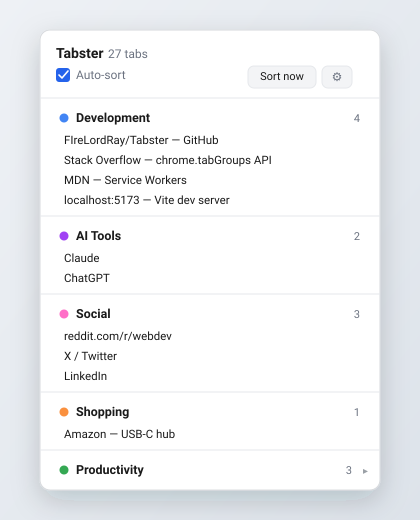

# Tabster

A browser extension that automatically sorts your open tabs into color-coded
categories — because "60,000 tabs open and no idea what's in any of them" is
not a workflow.

<p align="center">
  
</p>

## What it does

Tabster watches your open tabs and groups them into Chrome's native **Tab
Groups** by domain (`github.com` → Development, `youtube.com` → Video &
Media, …), so instead of a flat wall of tabs you get a small set of
color-coded, collapsible clusters. A popup widget shows the same breakdown at
a glance — counts per category, click a tab to jump to it, one click to close
it — and an options page lets you add, rename, recolor, or delete categories
without touching code.

**Highlights**
- Automatic categorization by domain/keyword — no AI calls, no network
  requests, nothing leaves your browser
- Groups tabs into real Chrome Tab Groups, not just a sidebar list — the
  organization persists in the browser itself
- Auto-sorts on new tabs and navigation (toggle off for manual control)
- Rules are data, not code: stored in `chrome.storage.sync` and fully
  editable from the options page, so the category list scales without a
  redeploy
- Grouping is batched per window (one API call per category, not per tab),
  so it stays fast with hundreds of tabs open across multiple windows

## Why I built this

I had the classic too-many-tabs problem — dozens of tabs across a dozen
different contexts (work, dev references, random reading) with no structure.
Rather than manually drag tabs into groups, I wanted something that did it
for me and stayed out of the way: no server, no account, no data leaving the
browser, just a small extension watching tab events and doing the sorting.

## Install (unpacked, for now — not yet on the Chrome Web Store)

1. Open `chrome://extensions` (or `edge://extensions`)
2. Turn on **Developer mode** (top right)
3. Click **Load unpacked** and select this repo's folder
4. Pin the extension, then click its icon to open the widget

## How it works

```
manifest.json         extension manifest (MV3)
rules.js               default categories + categorization + storage logic (shared)
background.js          service worker: listens for tab events, does the grouping
popup.html/js/css      the widget: category breakdown, jump-to-tab, close-tab
options.html/js/css    category/rule editor
demo/                  static mock + preview image for this README (not part of the extension)
```

Categorization is a longest-domain-match: `mail.google.com` is checked
before a hypothetical bare `google.com` rule, so more specific domains always
win. Tab groups are window-scoped in Chrome, so sorting batches one
`chrome.tabs.group()` call per category per window rather than one call per
tab — the part of the design meant to keep this fast regardless of how many
tabs or windows are open.

## Security notes

Grading/execution of arbitrary code isn't part of this project's surface —
Tabster only reads tab titles/URLs and moves tabs between groups. The main
risk category for an extension like this is XSS from untrusted page metadata
(tab titles, favicon URLs) rendered in the popup/options UI; both are built
via DOM properties/`textContent` rather than `innerHTML` string concatenation
specifically to avoid that.

## License

MIT — see [LICENSE](LICENSE).
